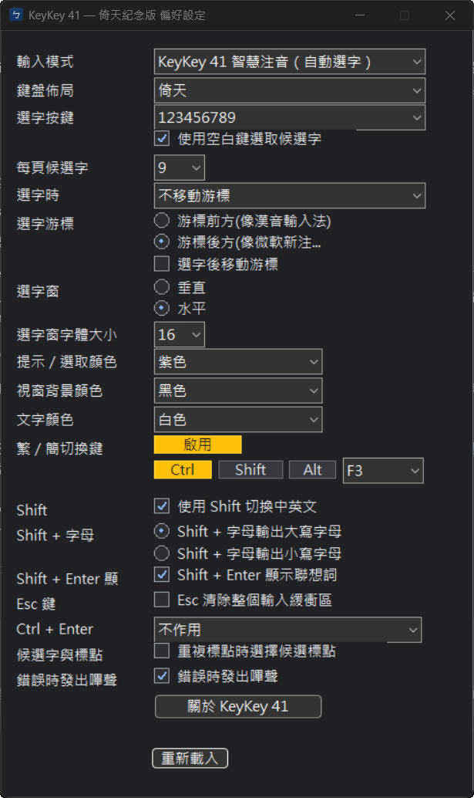

# KeyKey 41 — 倚天紀念版


KeyKey 41 是一套為 Windows 11 開發的繁體中文注音輸入法。它以 Yahoo! 奇摩輸入法（Yahoo KeyKey）的使用體驗為參考，採用現代 Windows TSF 架構重新實作，並保留倚天 41 鍵及傳統注音鍵盤配置。

本專案是社群紀念作品，與 Yahoo 或 Yahoo! 奇摩沒有隸屬、授權或合作關係。「Yahoo」及「Yahoo!」為其各自權利人的商標。

## 主要功能

- 倚天 41 鍵與傳統注音鍵盤配置
- 智慧注音選字及候選字視窗
- 繁體、簡體與英文輸入模式
- 左側 Shift 切換中文／英文
- `Ctrl + F3` 切換繁體／簡體，並可在偏好設定中自訂組合鍵
- 全形／半形切換
- Yahoo KeyKey 風格的 Shift、Ctrl 標點與特殊符號輸入
- 符號表
- 自訂詞彙編輯、匯入與匯出
- 候選視窗方向、字體大小、提示顏色、背景顏色及文字顏色設定
- 同時包含 x64 與 x86/WOW64 輸入法元件，支援 64 位元及 32 位元 Windows 應用程式

更完整的實作範圍請參閱 [KeyKey 功能對照](docs/keykey-feature-coverage.md) 與 [Windows 相容性及發行檢查表](docs/windows-compatibility-release-checklist.md)。

## 下載與安裝

請到 [Releases](../../releases) 下載最新版 MSI 安裝檔。目前測試版本為 `0.9.4-beta.1`。

Windows SmartScreen 可能會因安裝檔尚未具備程式碼簽章而顯示警告。請只從本專案的 Releases 頁面下載，並對照發行說明所列的 SHA-256。

在 64 位元 Windows 上，程式預設安裝於：

```text
C:\Program Files\KeyKey41\EtenTribute\
```

安裝完成後，請在 Windows 的語言及輸入法選單中選擇 KeyKey 41。

## 如何開啟偏好設定

1. 先切換到 **KeyKey 41** 輸入法。
2. 在 Windows 工作列右下角找到 KeyKey 41 的輸入法圖示。
3. 在圖示上按下滑鼠右鍵。
4. 從選單中選擇 **「設定」**，即可進入偏好設定。

設定變更會在操作時自動儲存。若目前已開啟的程式尚未套用新設定，可按偏好設定下方的 **「重新載入」**，或重新切換一次輸入法。



偏好設定可調整：

- 輸入模式與鍵盤配置
- 選字按鍵、每頁候選字數量及游標方式
- 候選字視窗方向、字體大小與配色
- 繁體／簡體切換快捷鍵
- Shift、Shift + 字母、Shift + Enter、Esc 與 Ctrl + Enter 行為

## 常用快捷鍵

| 功能 | 預設按鍵 |
|---|---|
| 中文／英文切換 | 左側 Shift |
| 繁體／簡體切換 | Ctrl + F3 |
| 全形／半形切換 | Shift + Space |
| 全形逗號 `，` | 右側 Shift + `,` |
| 全形句號 `。` | 右側 Shift + `.` |
| 左雙引號 `『` | 右側 Shift + `[` |
| 右雙引號 `』` | 右側 Shift + `]` |

實際按鍵行為亦會受到偏好設定影響。

## 系統相容性

主要支援 Windows 11 x64，安裝檔同時包含 x64 與 x86 TIP，因此可在一般 64 位元及 32 位元/WOW64 應用程式中使用。

部分較舊的 Win32 軟體、Office 對話框、系統管理員權限程式或特殊文字欄位，可能以不同方式處理 TSF/IMM32 狀態通知。相關相容性考量與發行前檢查項目已記錄於專案文件中。ARM64 目前尚未完成實機驗證。

## 從原始碼建置

需要：

- Visual Studio 2022，包含「使用 C++ 的桌面開發」及 x64/x86 工具
- Windows 10/11 SDK
- CMake 3.20 以上
- WiX Toolset 7 與 UI、Util extensions

```powershell
git clone --recurse-submodules https://github.com/whyren0324/KeyKey41-Eten-Tribute.git
cd KeyKey41-Eten-Tribute
.\build_msi.ps1
```

完成後的 MSI 位於 `dist\`。其他建置資訊請參閱 [開發文件](docs/README.md)。

## 致謝與授權

本專案參考及使用了 [win-mcbopomofo](https://github.com/openvanilla/win-mcbopomofo)、[McBopomofo](https://github.com/openvanilla/McBopomofo) 與 [YahooArchive/KeyKey](https://github.com/YahooArchive/KeyKey) 的公開成果。各第三方元件仍依其原有授權條款使用。

本專案依 [MIT License](LICENSE.txt) 發布；詳細的第三方授權資訊請參閱專案內文件。
