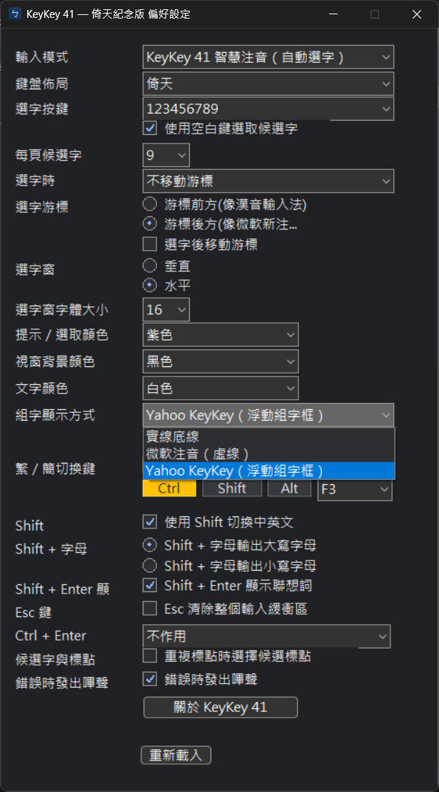

# KeyKey 41 — 倚天紀念版

[繁體中文](README.md) | [English](README.en.md)


KeyKey 41 是一套為 Windows 11 開發的繁體中文注音輸入法。它參考 Yahoo! 奇摩
輸入法（Yahoo KeyKey）的使用體驗，以現代 Windows TSF 架構重新實作，並保留
倚天 41 鍵及傳統注音鍵盤配置。

> 本專案是社群紀念作品，與 Yahoo 或 Yahoo! 奇摩沒有隸屬、授權或合作關係。
> 「Yahoo」及「Yahoo!」為其各自權利人的商標。

## 解決什麼問題

習慣 Yahoo KeyKey 或倚天 41 鍵配置的使用者，在現代 Windows 上缺少熟悉、仍可
維護的輸入法選擇。舊式輸入法架構也無法直接滿足 Windows 11、64 位元程式與
32 位元／WOW64 程式的相容性需求。

KeyKey 41 以 Windows TSF 重新建立核心體驗：

- 倚天 41 鍵與傳統注音配置；
- 智慧注音選字及候選字視窗；
- 繁體、簡體與英文輸入模式；
- Yahoo KeyKey 風格的 Shift、Ctrl 標點與特殊符號；
- 自訂詞彙、快捷鍵、候選視窗方向、字體與配色；
- 三種組字顯示方式：實線底線、微軟注音虛線、Yahoo KeyKey 浮動組字框；以及
- 同時包含 x64 與真正的 x86/WOW64 輸入法元件。

## 操作示範

以下為實際偏好設定畫面：



## Before / After

| Before：現代 Windows 上的斷層 | After：KeyKey 41 |
|---|---|
| 缺少 Yahoo KeyKey／倚天 41 鍵的熟悉操作方式 | 保留鍵盤配置、選字與快捷鍵習慣 |
| 舊式輸入法元件不符合現代 Windows 架構 | 以 Windows TSF Text Service 重新實作 |
| 64 位元與 32 位元應用程式需不同 TIP 架構 | MSI 同時安裝 x64 與 x86/WOW64 元件 |
| 候選字介面與按鍵行為難以調整 | 提供候選方向、字體、配色、快捷鍵與詞彙設定 |

## 安裝方式

1. 到 [Releases](https://github.com/whyren0324/KeyKey41-Eten-Tribute/releases/latest)
   下載最新版 MSI；目前測試版本為 `0.9.8-beta.1`。
2. 對照 Release 說明所列的 SHA-256。
3. 以系統管理員權限執行 MSI。
4. 安裝完成後，從 Windows 語言及輸入法選單選擇 **KeyKey 41**。

64 位元 Windows 的預設安裝位置：

```text
C:\Program Files\KeyKey41\EtenTribute\
```

> 安裝檔目前尚未加入程式碼簽章，Windows SmartScreen 可能顯示警告。請只從
> 本 repository 的 Releases 頁面下載並核對 checksum。

KeyKey 41 是系統輸入法，需要 TSF／COM 註冊，因此不提供宣稱「免安裝」的
Portable 版本。

## 使用方式

### 開啟偏好設定

1. 切換到 **KeyKey 41** 輸入法。
2. 在工作列右下角找到 KeyKey 41 輸入法圖示。
3. 在圖示上按滑鼠右鍵。
4. 選擇 **設定**。


設定會自動儲存。若已開啟的程式尚未套用新設定，可選擇 **重新載入**，或重新
切換一次輸入法。

### 常用快捷鍵

| 功能 | 預設按鍵 |
|---|---|
| 中文／英文切換 | 左側 Shift |
| 繁體／簡體切換 | Ctrl + F3 |
| 全形／半形切換 | Shift + Space |
| 全形逗號 `，` | 右側 Shift + `,` |
| 全形句號 `。` | 右側 Shift + `.` |
| 左雙引號 `『` | 右側 Shift + `[` |
| 右雙引號 `』` | 右側 Shift + `]` |

實際按鍵行為會受到偏好設定影響。完整範圍請參考
[KeyKey 功能對照](docs/keykey-feature-coverage.md)。

## 從原始碼建置

需求：

- Visual Studio 2022，包含「使用 C++ 的桌面開發」與 x64/x86 工具
- Windows 10/11 SDK
- CMake 3.20 以上
- WiX Toolset 7 與 UI、Util extensions

```powershell
git clone --recurse-submodules https://github.com/whyren0324/KeyKey41-Eten-Tribute.git
cd KeyKey41-Eten-Tribute
.\build_msi.ps1
```

完成後的 MSI 位於 `dist\`。其他資訊請參考[開發文件](docs/README.md)及
[安裝程式文件](docs/installer.md)。

## Roadmap

- 完成 Windows 11 x64 與 x86/WOW64 發行檢查，推進至穩定版 1.0。
- 改善舊版 Win32、Office 對話框、系統管理員程式及特殊文字欄位的相容性。
- 建立原生 ARM64 建置與實機驗證流程。
- 評估程式碼簽章，減少 SmartScreen 與安裝信任問題。
- 改善安裝、升級、移除及版本遷移體驗。

Roadmap 是規劃方向，不代表已承諾發行日期。因 Windows 輸入法需要系統註冊，
真正的免安裝 Portable 版本不在目前規劃內。

## Todo

- [ ] 完成發行檢查表中的 x64 與 x86 相容性驗證。
- [ ] 測試更多 Office、Chromium 與舊版 Win32 輸入欄位。
- [ ] 建立 ARM64 原生編譯與測試環境。
- [ ] 自動核對 EXE、DLL 與 MSI 的版本資訊。
- [ ] 評估可負擔的程式碼簽章方案。

完整項目請參考
[Windows 相容性及發行檢查表](docs/windows-compatibility-release-checklist.md)。

## 致謝與授權

本專案參考及使用了 [win-mcbopomofo](https://github.com/openvanilla/win-mcbopomofo)、
[McBopomofo](https://github.com/openvanilla/McBopomofo) 與
[YahooArchive/KeyKey](https://github.com/YahooArchive/KeyKey) 的公開成果。
第三方元件仍依各自授權條款使用。

本專案採用 [MIT License](LICENSE.txt)。
