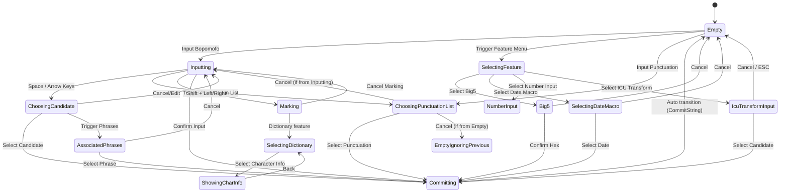

# Input State Transitions

## 1. Purpose

This document describes the meanings of various `InputState` classes in `src/Server/InputState.h`, as well as their primary transition paths in `KeyHandler` / `InputController`.

This is an implementation-oriented document. It does not attempt to cover every key branch but instead summarizes the main states and common paths.

## 2. State Grouping

### Base States

- `Empty`
  The base state indicating no input content.
- `EmptyIgnoringPrevious`
  Discards the previous state and does not produce additional side effects.
- `Committing`
  Represents the intent to commit text; it is not a stable resting state.
- `StateSequence`
  Triggered by a single key, processes multiple states sequentially.

### States with a Composing Buffer

- `NotEmpty`
  The common base class for all states with a preedit buffer.
- `Inputting`
- `ChoosingCandidate`
- `ChoosingPunctuationList`
- `Marking`
- `SelectingDictionary`
- `ShowingCharInfo`
- `AssociatedPhrases`
- `NumberInput`
- `CustomMenu`

### Candidate-Only or Special States without a Composing Buffer

- `AssociatedPhrasesPlain`
- `Big5`
- `IcuTransformInput`
- `SelectingDateMacro`
- `SelectingFeature`

Note:

- Although `Big5` / `Iroha` can display strings, they are not `NotEmpty`.
- `SelectingFeature` / `SelectingDateMacro` are candidate-only states.
- These states should not be treated as general TSF composition states.

## 3. Primary Transition Paths

### State Diagram

### 3.1 Normal Input

Common path:

1. `Empty`
2. `Inputting`
3. `ChoosingCandidate` or `Committing`
4. `Empty` or return to `Inputting`

Explanation:

- After the user inputs Bopomofo symbols, `KeyHandler::buildInputtingState()` creates an `Inputting` state.
- Under appropriate conditions, the space bar or arrow keys can transition to `ChoosingCandidate`.
- If directly confirmed, it may transition to `Committing`.
- `InputController::ChangeState()` converts `Committing` into `ui_->CommitString(...)`, and then falls back to `Empty`.

### 3.2 Punctuation Candidates

Common path:

1. `Inputting` or `Empty`
2. `ChoosingPunctuationList`
3. `Committing` or `Inputting` / `EmptyIgnoringPrevious`

### 3.3 Feature Menu

Common path:

1. `Empty` or other states
2. `StateSequence(Empty -> SelectingFeature)`
3. `SelectingFeature`
4. Enters depending on the selection:
   - `Big5`
   - `SelectingDateMacro`
   - `NumberInput`
   - `IcuTransformInput`

### 3.4 Date Macro

Common path:

1. `SelectingFeature`
2. `SelectingDateMacro`
3. `Committing`
4. `Empty`

This is a very important direct commit path:

- `SelectingDateMacro` does not have a composing buffer.
- Once selected, it directly produces `Committing(text)`.
- The Client may receive `commitString != empty` while `composingBuffer == empty`.

### 3.5 Big5

Common path:

1. `SelectingFeature`
2. `Big5`
3. `Big5` continues to accumulate hexadecimal input.
4. `Committing` or `Empty`

### 3.6 IcuTransformInput

Common path:

1. `SelectingFeature`
2. `IcuTransformInput`
3. `IcuTransformInput` displays transformed script candidate candidates as characters are typed.
4. `Committing` or `Empty`

### 3.7 User Phrases, Marking and Character Info

Common path:

1. `Inputting`
2. `Marking`
3. `Inputting` or remains in `Marking`
4. `SelectingDictionary`
5. `ShowingCharInfo`

Explanation:

- `ShowingCharInfo` is a state that displays detailed metadata about a specific character (Unicode code points, encoding info, etc.). 
- It is typically entered from the dictionary selection menu (`SelectingDictionary`) when the user chooses "Character Information".

### 3.8 Associated Phrases

Common path:

1. `Inputting` or `ChoosingCandidate`
2. `AssociatedPhrases` or `AssociatedPhrasesPlain`
3. Returns to `Inputting`, `Committing`, or `Empty` after character selection.

## 4. Key Triggers for Special States

The input method is state-driven, so a key does not have one global meaning.
Each key is interpreted together with the current state. The table below lists
the main keys that enter special states.

### 4.1 Feature Menu and Feature States

| Key / action | Required current state | Resulting state | Notes |
| --- | --- | --- | --- |
| `Ctrl+\` | Any state accepted by `KeyHandler::handle()` | `StateSequence(Empty -> SelectingFeature)` | Clears the current state first, then opens the feature menu. |
| Select "Big5 input" in `SelectingFeature` | `SelectingFeature` | `Big5` | Enters Big5 hex input mode. |
| Select "Date and time" in `SelectingFeature` | `SelectingFeature` | `SelectingDateMacro` | Opens a candidate-only date/time macro menu. |
| Select "Number input" in `SelectingFeature` | `SelectingFeature` | `NumberInput` | Enters numeric conversion mode. |
| Select "Multilingual transliteration" in `SelectingFeature` | `SelectingFeature` | `IcuTransformInput` | Enters ICU-based script transformation input mode. |

### 4.2 Candidate, Punctuation, and Menu States

| Key / action | Required current state | Resulting state | Notes |
| --- | --- | --- | --- |
| `Space` | `Inputting`, no active reading, and candidate selection by space enabled | `ChoosingCandidate` | Opens candidates for the reading grid around the current cursor. |
| `Down` | `Inputting`, no active reading | `ChoosingCandidate` | Alternative candidate-opening key. |
| `` ` `` | No active Bopomofo reading and punctuation-list data available | `ChoosingPunctuationList` | Inserts the punctuation-list pseudo reading and opens punctuation candidates. |
| `?` | `ChoosingCandidate` | `SelectingDictionary` | Opens dictionary services for the highlighted candidate, if services are available. |
| `?` | `Marking` | `SelectingDictionary` | Opens dictionary services for the marked phrase. |
| Select "Character Information" in `SelectingDictionary` | `SelectingDictionary` | `ShowingCharInfo` | Displays metadata for the selected phrase or character. |
| `+` / `=` | `ChoosingCandidate` | `CustomMenu` | Opens the boost menu for eligible multi-syllable candidates. |
| `-` / `_` | `ChoosingCandidate` | `CustomMenu` | Opens the exclude menu for eligible multi-syllable candidates. |

### 4.3 Marking and User Phrase States

| Key / action | Required current state | Resulting state | Notes |
| --- | --- | --- | --- |
| `Shift+Left` / `Shift+Right` | `Inputting` or `Marking` | `Marking` | Starts or extends a marked phrase range for adding a user phrase. |
| `Enter` | `Marking` with an acceptable marked phrase | `Inputting` | Adds the marked phrase to user phrases and returns to normal input. |
| `Enter` | `Marking` with an invalid marked phrase | `Marking` | Stays in marking mode and reports the validation status. |

### 4.4 Associated Phrase States

| Key / action | Required current state | Resulting state | Notes |
| --- | --- | --- | --- |
| Compose a syllable | `Inputting`, McBopomofo mode, associated phrases enabled | `AssociatedPhrases` | Auto-triggered associated phrase hint may appear after the inputting state is produced. |
| `Tab` | Auto-triggered `AssociatedPhrases` | `AssociatedPhrases` | Expands the auto-triggered one-candidate hint into the full associated phrase list. |
| `Shift+Enter` | `Inputting`, McBopomofo mode, associated phrases enabled | `AssociatedPhrases` | Manually opens associated phrases for the current inputting state. |
| `Shift+Enter` | `ChoosingCandidate`, McBopomofo mode | `AssociatedPhrases` | Opens associated phrases based on the highlighted candidate. |
| Plain Bopomofo auto-commit | `Inputting`, Plain Bopomofo mode, associated phrases enabled | `AssociatedPhrasesPlain` | After a single reading is committed, follow-up associated phrase candidates may be shown. |

### 4.5 Special State Continuations

| Key / action | Required current state | Resulting state | Notes |
| --- | --- | --- | --- |
| Hex digit | `Big5` | `Big5` or `Committing` | Accumulates up to four hex digits; a complete valid Big5 code commits text. |
| `Esc` | `Big5` | `Empty` | Cancels Big5 input. |
| Letter / printable key | `IcuTransformInput` | `IcuTransformInput` | Accumulates input string and generates transliteration candidates. |
| Digit / decimal key | `NumberInput` | `NumberInput` | Updates the numeric conversion candidates. |
| Select candidate | `NumberInput` / `SelectingDateMacro` / `IcuTransformInput` | `Committing` | These special candidate states directly commit selected text. |
| `Esc` / `Backspace` | Candidate or menu states | Previous state or `EmptyIgnoringPrevious` | Candidate-layer cancellation is handled by `InputController`. |

## 5. The Specificity of `Committing`

`Committing` is not a UI state, but an action state.

In `InputController::ChangeState()`:

1. If the new state is `Committing`
2. It will call `ui_->CommitString(text)`
3. It then replaces the state with `Empty`

Therefore:

- The Server logically can produce `Committing`.
- But the client will not receive a stable state named `Committing`.
- What the client receives is:
    - `commitString` is populated
    - Then combined with `Reset()` / `Update()` to form the final payload.

## 6. Difference between `Empty` and `EmptyIgnoringPrevious`

- `Empty`
  Allows the previous state to produce side effects, such as committing.
- `EmptyIgnoringPrevious`
  Explicitly indicates to discard the previous state and not to rely on the previous state anymore.

In `InputController::ChangeState()`, both will eventually cause the controller to fall back to `Empty`, but with different semantics.

## 7. Common Rules for Candidate States

In `InputController`, the following states are treated as candidate states:

- `ChoosingCandidate`
- `SelectingDictionary`
- `ShowingCharInfo`
- `AssociatedPhrases`
- `AssociatedPhrasesPlain`
- `NumberInput`
- `SelectingFeature`
- `SelectingDateMacro`
- `IcuTransformInput`
- `CustomMenu`

Common characteristics of these states:

- `HandleKey()` will first branch into `HandleCandidateKey()`.
- `candidateIndex_` is managed by `InputController`.
- Arrow keys, Home/End, PageUp/PageDown, and space bar page turning are all handled at this layer.

## 8. Documentation Maintenance Principles

If a new `InputState` type is added, you must synchronously update at least:

1. The state grouping in this document.
2. The description of `CandidateCount()` / `IsCandidateState()`.
3. How `ServerUI::Update()` maps the payload.
4. How the Client displays or commits it.
