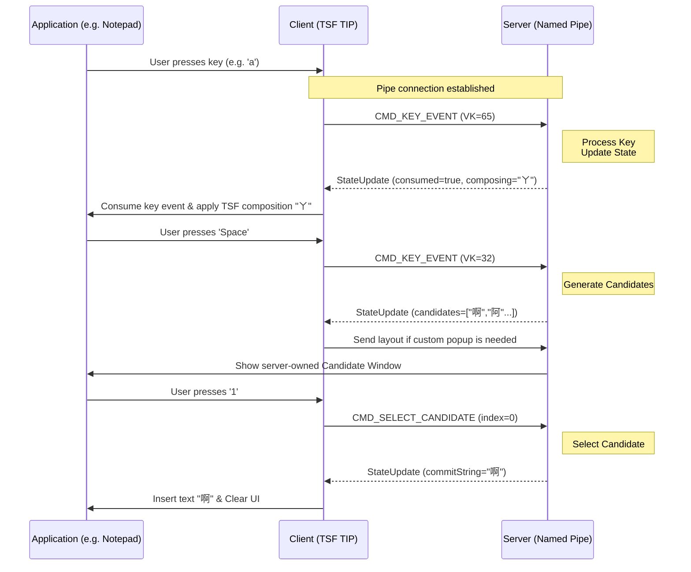

# Win-McBopomofo IPC Protocol Documentation

## Overview

Win-McBopomofo uses **Windows Named Pipes** for Inter-Process Communication (IPC), connecting the Client (TSF TIP) and the Server (Input Method Core Engine).

- **Pipe Name**: `\\.\pipe\WinMcBopomofo_IPC_Pipe`
- **Transport Method**: Synchronous Request-Response pattern
- **Serialization Format**: Newline-delimited text format
- **Compatibility Policy**: Deserializers accept only the current exact field layout. There is no backward-compatible parsing for old payload shapes.

## Communication Architecture

```
┌──────────────────┐                      ┌──────────────────┐
│  Client (TIP)    │                      │  Server (Engine) │
│  McBopomofoTIP   │◄─────────────────►   │  McBopomofoServer│
│   DLL Process    │   Named Pipe IPC     │   Background Svc │
└──────────────────┘                      └──────────────────┘
       ^                                            ^
       │                                            │
   Key Events                              State Updates
   Candidate Selection                     Composing Buffer
   Reset/Reload                            Candidates List
```

### IPC Sequence Diagram



## Command Types

### Command Enum

```cpp
enum class Command : int {
    CMD_RESET = 0,              // Reset input state
    CMD_KEY_EVENT = 1,          // Keyboard event
    CMD_SELECT_CANDIDATE = 2,   // Select candidate
    CMD_RELOAD_SETTINGS = 3,    // Reload settings
    CMD_OPEN_SETTINGS = 4,      // Open configuration app
    CMD_GET_SETTINGS = 5,       // Get settings needed by the Client
    CMD_CLIENT_LOG = 6,         // Relay Client-side log message
};
```

---

## Command Details

### 1. CMD_RESET (0) - Reset State

**Purpose**: Clears the input state of the Server and commits the text in the buffer.

**Trigger Scenarios**:

- Pressing Ctrl + Space to toggle Chinese/English mode
- The Client requests to terminate the current input

**Request Format**:

```
0
```

**Response Format**:
See [StateUpdate Format](#stateupdate-format)

**Server Behavior**:

1. Call controller.Reset()
   - Completes the current input
   - Commits the text in the buffer (commitString)
   - Clears composingBuffer
2. Update state and return

**Example**:

```
Request:  "0\n"
Response: StateUpdate with consumed=true, commitString set to the pending composing text, and composingBuffer cleared.
```

---

### 2. CMD_KEY_EVENT (1) - Keyboard Event

**Purpose**: Sends a keyboard key event to the Server for input processing.

**Trigger Scenarios**:

- User presses any keyboard key (while IME is enabled)
- The Client can determine the focused TSF context or caret rectangle while handling the key.

**Request Format**:

```
1
<VK_CODE>
<ASCII_CODE>
<SHIFT>
<CTRL>
<HAS_COORDS>
<OWNER_HWND>
<ANCHOR_LEFT>
<ANCHOR_TOP>
<ANCHOR_RIGHT>
<ANCHOR_BOTTOM>
```

| Field | Type | Description |
|------|------|------|
| VK_CODE | unsigned int | Virtual Key Code (e.g., VK_SPACE = 32) |
| ASCII_CODE | unsigned int | ASCII value (optional, valid when typing) |
| SHIFT | bool (0/1) | Whether Shift key is pressed |
| CTRL | bool (0/1) | Whether Ctrl key is pressed |
| HAS_COORDS | bool (0/1) | Whether the request contains a valid popup anchor rectangle |
| OWNER_HWND | uint64 | Owner or focused HWND value, serialized as an integer; `0` when unavailable |
| ANCHOR_LEFT | int | Left edge of the screen-space anchor rectangle |
| ANCHOR_TOP | int | Top edge of the screen-space anchor rectangle |
| ANCHOR_RIGHT | int | Right edge of the screen-space anchor rectangle |
| ANCHOR_BOTTOM | int | Bottom edge of the screen-space anchor rectangle |

The coordinate fields are part of the key event because the Client is already inside the foreground TSF host process while handling `OnKeyDown()`. When `HAS_COORDS == 1`, the Server stores this geometry and can use it immediately if the key event produces candidates or tooltip text. If the Client cannot obtain geometry, it sends `HAS_COORDS == 0`; the Server keeps using the latest valid layout data until another key event provides a new anchor.

All key event fields are required. When `HAS_COORDS == 0`, the Client still serializes `OWNER_HWND` and all anchor fields, usually as `0`.

**Response Format**:
See [StateUpdate Format](#stateupdate-format)

**Server Behavior**:

```
1. Convert Key Event to internal Key structure
2. If HAS_COORDS is true, update the latest popup layout anchor
3. Call controller.HandleKey(key)
4. Obtain the new input state
5. Return StateUpdate
```

**Examples**:

*Example 1: Pressing the 'a' key*

```
Request:
1
65          (VK_A)
97          (ASCII 'a')
0           (SHIFT not pressed)
0           (CTRL not pressed)
1           (has anchor coordinates)
123456      (owner HWND)
100         (anchor left)
200         (anchor top)
116         (anchor right)
224         (anchor bottom)

Response:
StateUpdate with consumed=true, cursorIndex=1, composingBuffer="ㄚ", and no candidates.
```

*Example 2: Pressing Ctrl+Space*

```
Request:
1
32          (VK_SPACE)
0           (ASCII)
0           (SHIFT not pressed)
1           (CTRL pressed)
0           (no anchor coordinates)
0           (owner HWND)
0           (anchor left)
0           (anchor top)
0           (anchor right)
0           (anchor bottom)

Response:
(Server will send RESET instead of processing this key)
(See: CMD_RESET)
```

*Example 3: Pressing Space (select character)*

```
Request:
1
32          (VK_SPACE)
32          (ASCII)
0           (SHIFT not pressed)
0           (CTRL not pressed)
0           (no anchor coordinates)
0           (owner HWND)
0           (anchor left)
0           (anchor top)
0           (anchor right)
0           (anchor bottom)

Response:
StateUpdate with consumed=true, commitString="你", composingBuffer empty, and no candidates.
```

---

### 3. CMD_SELECT_CANDIDATE (2) - Select Candidate

**Purpose**: Selects a candidate at the specified index in the candidate window.

**Trigger Scenarios**:

- User presses a number key (1-9) to select a candidate
- User navigates with up/down arrows and presses Space/Enter

**Request Format**:

```
2
<INDEX>
```

| Field | Type | Description |
|------|------|------|
| INDEX | int | Candidate index (0-based) |

**Response Format**:
See [StateUpdate Format](#stateupdate-format)

**Server Behavior**:

```
1. Call controller.SelectCandidate(index)
2. Select the corresponding candidate based on index
3. Return the updated state
```

**Example**:

```
Request:
2
1           (Select the 2nd candidate)

Response:
StateUpdate with consumed=true, commitString="好的", composingBuffer empty, and no candidates.
```

---

### 4. CMD_RELOAD_SETTINGS (3) - Reload Settings

**Purpose**: Notifies the Server to reload the settings file (mcbopomofo.ini).

**Trigger Scenarios**:

- After settings are modified and saved in the Settings UI
- When the Client detects a configuration file change

**Request Format**:

```
3
```

**Response Format**:
See [StateUpdate Format](#stateupdate-format)

**Server Behavior**:

```
1. Re-read mcbopomofo.ini
2. Apply new settings to the controller
3. Return current state
```

**Example**:

```
Request:
3

Response:
StateUpdate with the current refreshed UI state.
```

---

### 5. CMD_OPEN_SETTINGS (4) - Open Settings

**Purpose**: Requests the Server to launch the configuration utility (`McBopomofoConfig.exe`).

**Trigger Scenarios**:

- User selects "Settings" from the Language Bar menu (Client DLL).

**Request Format**:

```
4
```

**Response Format**:
See [StateUpdate Format](#stateupdate-format)

**Server Behavior**:

1. Locates the settings executable relative to the Server's path.
2. Launches the process.
3. Returns current state.

---

### 6. CMD_GET_SETTINGS (5) - Get Client Settings

**Purpose**: Requests settings values that the Client needs while running inside host applications.

**Trigger Scenarios**:

- The Client needs to know whether Shift toggles the open/close state.

**Request Format**:

```
5
```

**Response Format**:

```
<SHIFT_TOGGLE_OPEN_CLOSE>
```

| Field | Type | Description |
|------|------|------|
| SHIFT_TOGGLE_OPEN_CLOSE | bool (0/1) | Whether Shift toggles the IME open/close state |

**Server Behavior**:

1. Reads the current settings.
2. Returns a `ClientSettingsPayload`.

---

### 7. CMD_CLIENT_LOG (6) - Relay Client Log

**Purpose**: Sends diagnostic log messages from the Client DLL process to the Server log.

**Request Format**:

```
6
<PROCESS_ID>
<ELAPSED_MS>
<MESSAGE_SIZE>
<MESSAGE>
```

| Field | Type | Description |
|------|------|------|
| PROCESS_ID | unsigned long | Host process ID that loaded the Client DLL |
| ELAPSED_MS | uint64 | Elapsed milliseconds reported by the Client |
| MESSAGE | string | Client log message, encoded with the sized string format |

**Response Format**:

```
1
```

---

## Response: StateUpdate Format

Most commands return a **StateUpdate**, describing the current input state. `CMD_GET_SETTINGS` and `CMD_CLIENT_LOG` return their own response formats described above.

**Format**:

```
<CONSUMED>
<CURSOR_INDEX>
<CANDIDATE_INDEX>
<MARK_START>
<MARK_END>
<COMMIT_STRING_SIZE>
<COMMIT_STRING>
<COMPOSING_BUFFER_SIZE>
<COMPOSING_BUFFER>
<TOOLTIP_SIZE>
<TOOLTIP>
<CANDIDATES_COUNT>
<CANDIDATE_1_SIZE>
<CANDIDATE_1>
<CANDIDATE_2_SIZE>
<CANDIDATE_2>
<CANDIDATE_N...>
<CANDIDATE_KEYS_SIZE>
<CANDIDATE_KEYS>
<CANDIDATE_KEYS_COUNT>
```

### Field Descriptions

| Field | Type | Description |
|------|------|------|
| CONSUMED | bool (0/1) | Whether the key was consumed by the IME (true = IME handled, false = pass to application) |
| CURSOR_INDEX | int | Cursor position within the composingBuffer |
| CANDIDATE_INDEX | int | Currently highlighted candidate index (-1 = none selected) |
| MARK_START | int | Start position of the mark (-1 = no mark) |
| MARK_END | int | End position of the mark |
| COMMIT_STRING | string | Text to commit to the application |
| COMPOSING_BUFFER | string | The text currently being edited (Bopomofo or candidates) |
| TOOLTIP | string | Tooltip text (e.g., "Press Space to select") |
| CANDIDATES_COUNT | int | Number of candidates |
| CANDIDATE_N | string | The N-th candidate |
| CANDIDATE_KEYS | string | Candidate selection key labels |
| CANDIDATE_KEYS_COUNT | int | Number of candidate keys available |

Server-only popup rendering settings such as font size, forced vertical layout, selection style, candidate window orientation, hint text, and candidate colors are intentionally not serialized to the Client. The Server keeps those values in its own `StateUpdatePayload` instance for `CandidateWindow` and `TooltipWindow`.

### String Encoding Method

**Sized String Format**:

```
<SIZE_IN_BYTES>
<STRING_DATA>
```

- SIZE = Number of UTF-8 bytes in the string (excluding null terminator)
- Read SIZE bytes, then one '\n' must be read

**Example**: String "你好"

```
6           (UTF-8: "你" = 3 bytes, "好" = 3 bytes)
你好
```

---

## Serialization Implementation

### Basic Principles

1. **Newline Delimited**: All elements are separated by '\n'.
2. **Length-Prefixed Strings**: Variable-length strings use the format length + content + '\n'.
3. **Boolean Values**: 0 = false, 1 = true.
4. **Encoding**: All strings are UTF-8.

### C++ Implementation

Location of serialization and deserialization functions:

- Location: `src/Common/Ipc.h`, `src/Common/Ipc.cpp`
- Functions: `Serialize*()` and `Deserialize*()`

## Communication Flow Example

### Typical Input Flow

```
User types "你好"

1. User presses 'a'
   Client:  CMD_KEY_EVENT (VK=65, ASCII=97)
   Server:  StateUpdate (consumed=true, composingBuffer="ㄚ")
   Client:  Display "ㄚ" in composing area

2. User presses 'u'
   Client:  CMD_KEY_EVENT (VK=85, ASCII=117)
   Server:  StateUpdate (consumed=true, composingBuffer="ㄚㄨ", candidates=["你","..."])
   Client:  Update TSF candidate UIElement and send popup layout to Server if needed

3. User presses '1' to select first candidate
   Client:  CMD_SELECT_CANDIDATE (index=0)
   Server:  StateUpdate (consumed=true, composingBuffer="你")
   Client:  Update display

4. User presses 'e'
   Client:  CMD_KEY_EVENT (VK=69, ASCII=101)
   Server:  StateUpdate (consumed=true, composingBuffer="你ㄏㄜ", candidates=["好","..."])
   Client:  Update TSF candidate UIElement and send popup layout to Server if needed

5. User presses '1' to select first candidate
   Client:  CMD_SELECT_CANDIDATE (index=0)
   Server:  StateUpdate (consumed=true, commitString="好", composingBuffer="")
   Client:  Commit "好" to application, clear composing area
```

### Mode Switching Flow

```
User presses Ctrl+Space (in Chinese mode)

1. Client detects Ctrl+Space in OnTestKeyDown()
   Client:  CMD_RESET
   Server:  Reset internal state, commit any pending text
            StateUpdate (commitString="你好", composingBuffer="")
   
2. Client toggles IME mode via TSF API
   TSF:     Change GUID_COMPARTMENT_KEYBOARD_OPENCLOSE to 0 (closed)
   
3. Langbar button text updates
   "中" → "英"
```

---

## Error Handling

### Deserialization Failure

If deserialization fails:

- Returns false
- Client should log the error and attempt to reconnect
- Server logs the failed request and returns an empty response

### Pipe Connection Failure

**Client Side**:

- `NamedPipeClient::Call()` returns false
- Auto-retry (usually controlled by higher-level logic)
- If the Server is not running, Connection will fail

**Server Side**:

- Named Pipe Server runs in a background thread
- Uses a single Pipe instance per client connection
- Cleans up automatically when connection closes

---

## Performance Considerations

### Optimizations

1. **Newline Delimited**: Simple and fast text parsing
2. **Named Pipe**: Native to Windows, better performance than TCP/Socket
3. **Synchronous RPC**: Request-Response pattern, no complex state management

### Bottlenecks

- String conversions (`stoi()`, `stoull()`)
- Full serialization/deserialization for every keypress
- Pipe round-trip latency (typically < 1ms)

### Room for Improvement

- Use binary format (instead of text)
- Batch operations (send multiple commands at once)
- Conditional updates (only send changed fields)

---

## Version Compatibility

There is currently no versioning mechanism. If the Protocol needs to be modified:

1. Add new Command enum values
2. Update both serializers and deserializers in `src/Common/Ipc.cpp`
3. Update `tests/IpcTest.cpp`
4. Update this document

Do not add compatibility branches for older payload layouts unless the project explicitly introduces protocol versioning.

---

## Debugging Tips

### Viewing IPC Messages

The Server has detailed log output:

```
FCITX_MCBOPOMOFO_INFO() << "IPC Recv: VK=" << keyReq.vk << ", ...";
```

How to check logs:

```
# Enable Debug build
cmake -DCMAKE_BUILD_TYPE=Debug .
ctest --verbose
```

### Testing IPC Connection

```cpp
// Test connection
McBopomofo::IPC::NamedPipeClient pipe(McBopomofo::IPC::PIPE_NAME);
std::string response;
if (pipe.Call(McBopomofo::IPC::SerializeReset(), response)) {
    McBopomofo::IPC::StateUpdatePayload state;
    McBopomofo::IPC::DeserializeStateUpdate(response, state);
    // Process state...
} else {
    // Connection failed
}
```

---

## Related Code Locations

| Item | Location |
|------|------|
| IPC Definitions | `src/Common/Ipc.h` / `Ipc.cpp` |
| Named Pipe | `src/Common/NamedPipe.h` / `NamedPipe.cpp` |
| Server Implementation | `src/Server/main.cpp` |
| Client Implementation | `src/Client/McBopomofoTIP.cpp` |
| Key Mapping | `src/Server/WindowsKeyBridge.cpp` |

---

## FAQ

**Q: Why use a text format instead of binary?**
A: Easy to debug, human-readable, and good cross-platform encoding compatibility. The performance difference is acceptable in the current scenario.

**Q: How is Ctrl+Space handled?**
A: After the Client detects Ctrl+Space, it sends a CMD_RESET command to the Server. The Server executes Reset and commits the buffer contents.

**Q: How do I add a new command?**
A: Add a new value in the Command enum, implement serialization/deserialization functions, and add processing logic in the Server's main.cpp.

**Q: What does -1 mean in StateUpdate?**
A: -1 usually means "no value" or "not applicable", for example, candidateIndex=-1 means no candidate is selected.

---

*Document Last Updated: 2026-06-04*
*Version: 1.0 (Based on Commit without version tracking)*
