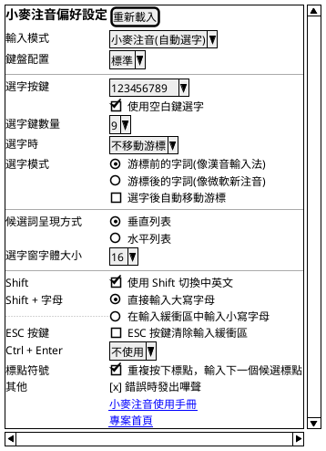

# 設定程式 layout

```plantuml
@startsalt
{S
  
  == 小麥注音偏好設定 | [重新載入]
  ' McBopomofo Preferences, Reload
  ' Reload button aligns to top-right corner
  輸入模式 | ^小麥注音(自動選字)^ 
  ' 輸入模式包括 "小麥注音(自動選字)" 與 "傳統注音(手動選字)"
  ' English: McBopomofo and Plain Bopomofo
  鍵盤配置 | ^標準^
  ' BopomofoKeyboardLayout
  ' 鍵盤配置包括: 標準、倚天、許式、倚天 26、漢語拼音、IBM
  ' English: Standard, ETen, Hsu, ETen 26, Hanyu Pinyin, IBM

  --- | ---
  選字按鍵 | ^123456789^
  ' SelectionKeys
  ' 123456789, asdfghjkl, asdfzxcvb
  . | [X] 使用空白鍵選字
  選字鍵數量 | ^9^
  ' selectionKeysCount
  ' 4,5,6,7,8,9
  選字時 | ^不移動游標^
  ' MovingCursorOption
  ' 不移動游標、JK 按鍵移動游標、HL 按鍵移動游標
  選字模式 | (X) 游標前的字詞(像漢音輸入法)
  .       | () 游標後的字詞(像微軟新注音)
  ' SelectPhrase
  .       | [] 選字後自動移動游標
  ' 
--- | ---
  候選詞呈現方式   | (X) 垂直列表
  .               | () 水平列表
  ' CandidateLayoutHint
  選字窗字體大小 | ^16^
  ' 10, 12, 14, 16, 18, 20, 24, 28
  ' by defaylt 18
  --- | ---
  Shift | [X] 使用 Shift 切換中英文
  ' ShiftToggleCloseOpen
  Shift + 字母 | (X) 直接輸入大寫字母
  ..          | () 在輸入緩衝區中輸入小寫字母
  ESC 按鍵 | [] ESC 按鍵清除輸入緩衝區
  Ctrl + Enter | ^不使用^
  ' CtrlEnter Option
  ' 不使用、輸入注音字根、輸入 HTML Ruby、輸入漢語拼音
  標點符號 | [X] 重複按下標點，輸入下一個候選標點
  其他 | [x] 錯誤時發出嗶聲
  . | <color:blue><u>小麥注音使用手冊</u></color>
  . | <color:blue><u>專案首頁</u></color>
}
@endsalt
```